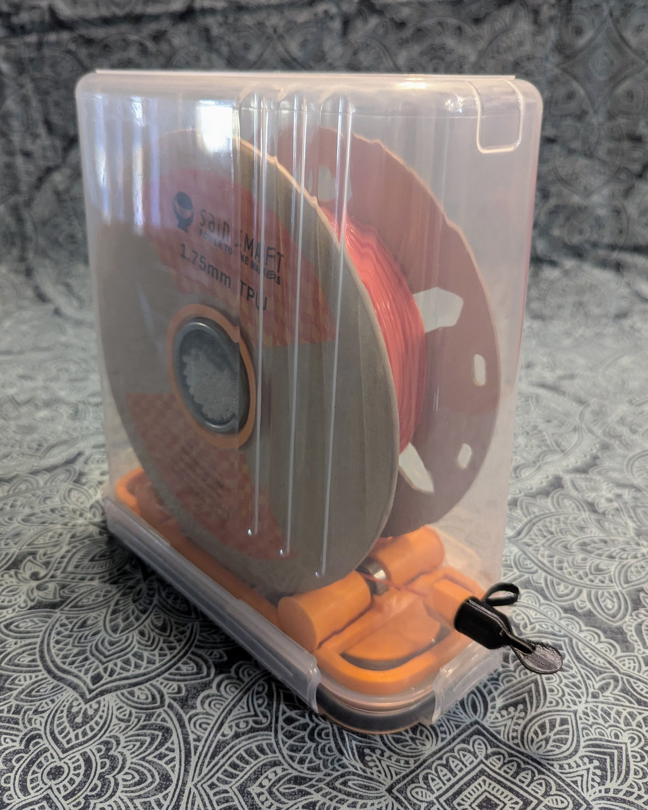
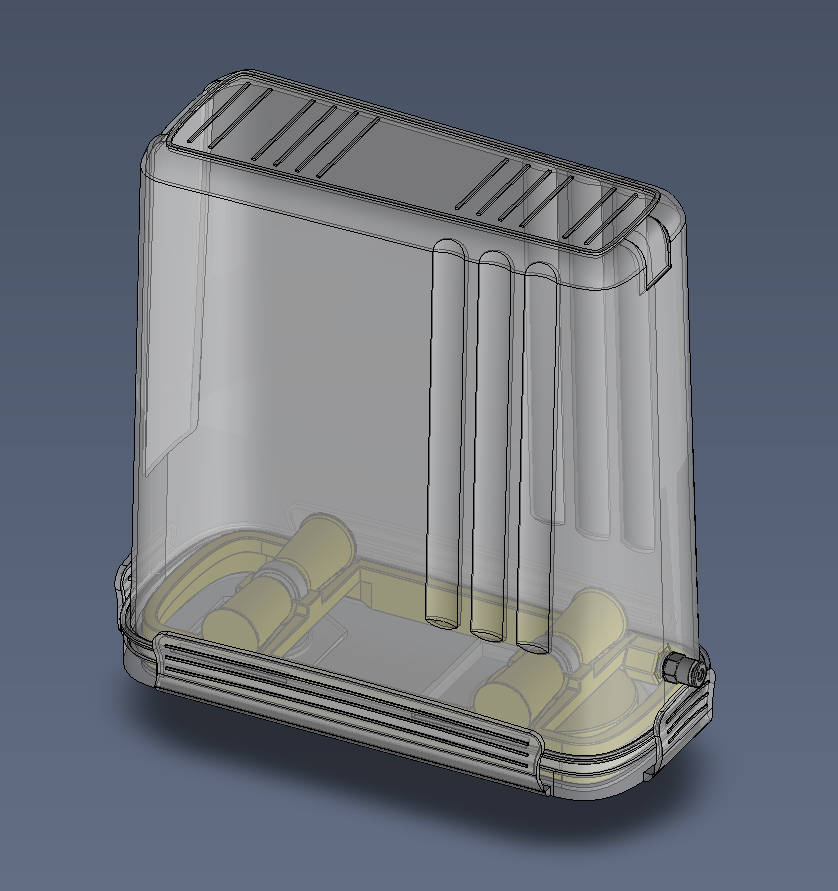
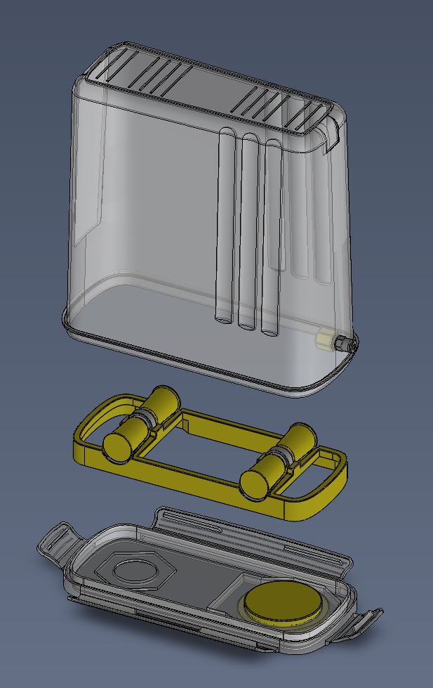
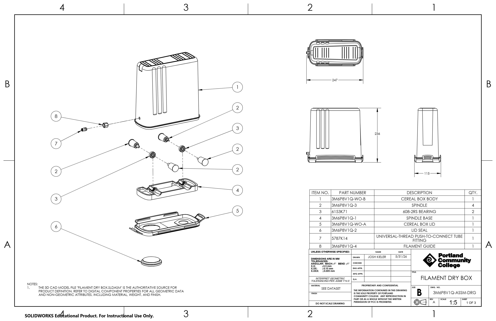
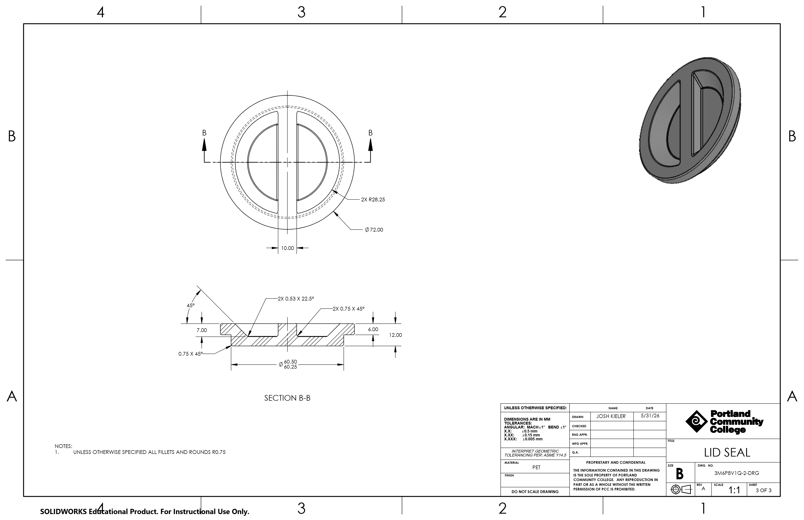
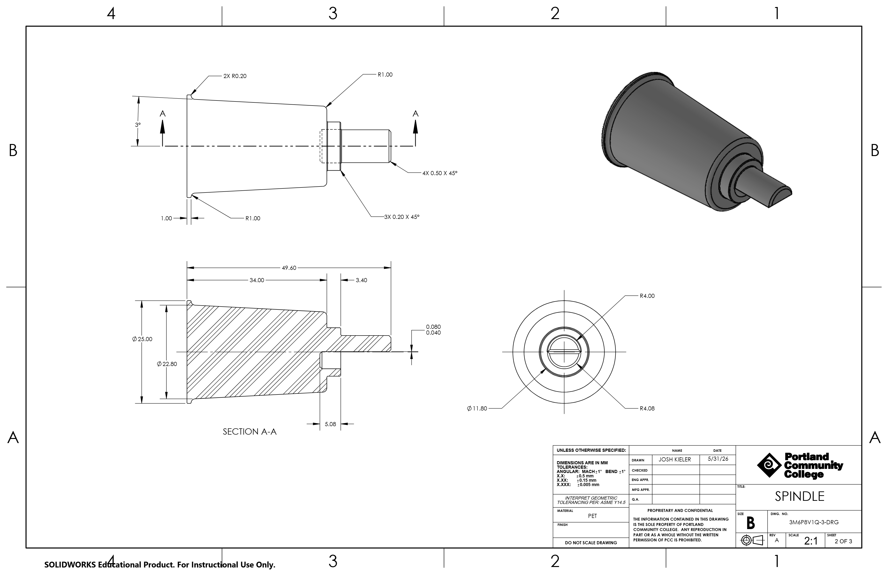
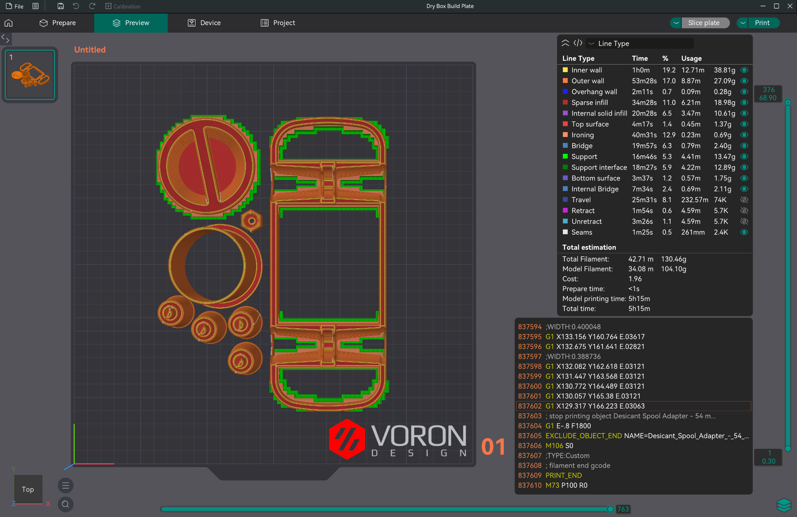

# Multi-Class Term Project: End-to-End Build

This project tracks a complete product development cycle, from identifying initial engineering constraints to executing multi-CAD data integration, detailed 2D production documentation, and physical manufacturing optimization.

  

<em>Figure 1: High-resolution rendering of the finalized assembly.</em>

---

## 1. Project Overview & Design Intent

The objective of this project was to engineer a functional mechanical solution addressing specific real-world parameters established during the initial Onshape phase. The design process prioritized structural integrity under load, geometric stability, and clean integration into an existing mechanical system.

### Key Design Constraints
* **Dimensional Envelope:** Tight spatial constraints to interface cleanly with existing components.
* **Fitment & Clearances:** Critical tolerance allocations to ensure smooth mechanical movement between moving features.
* **Manufacturing Limits:** Geometric constraints optimized specifically for additive manufacturing without sacrificing mechanical strength.

---

## 2. Parametric Modeling & Configuration Strategy

The design began as a conceptual model in Onshape before transitioning to SolidWorks for advanced configuration management and detailing. This required clean data migration, maintaining references, and managing step-file imports without geometry degradation.

  
  

<em>Figure 2: Side-by-side assembly configuration analysis demonstrating geometric variations.</em>

Using SolidWorks, the model was built using robust parametric feature trees to allow rapid design changes. Multiple assembly configurations were developed to account for different operating conditions and material variations, ensuring the design remained modular and scalable.

---

## 3. Production Documentation (2D Drafting)

A design is only as good as its documentation. A complete, production-ready drawing package was generated adhering to ASME standards to ensure seamless fabrication or machine-shop handoff.

   
   
  

<em>Figure 3: Multi-sheet 2D technical drawing package including full bill of materials (BOM).</em>

The drawing package includes:
* **Main Assembly Layout:** Complete with balloon callouts, standard orthographic projections, and an itemized Bill of Materials (BOM).
* **Detailed Part Sheets:** Two representative component drawings featuring section views, isometric details, precise dimensioning, and fitment tolerances.

---

## 4. Design for Manufacturing (DFM) & 3D Printing

To bridge the gap between digital modeling and physical production, the components were optimized for print-bed orientation, strength distribution, and rapid deployment.

*Figure 5: Slicing configuration preview in OrcaSlicer showcasing toolpath and layer strategy.*

### Slicing & Hardware Optimization
* **Slicer Tuning (OrcaSlicer):** Configured with optimized wall counts, specific infill geometry to maximize directional rigidity, and targeted layer heights to ensure structural integrity.
* **Hardware Execution:** Tailored specifically for a high-speed custom Voron machine running Klipper firmware. Tolerances were tuned to account for plastic shrinkage and thermal expansion, ensuring that parts fit perfectly right off the build plate.
