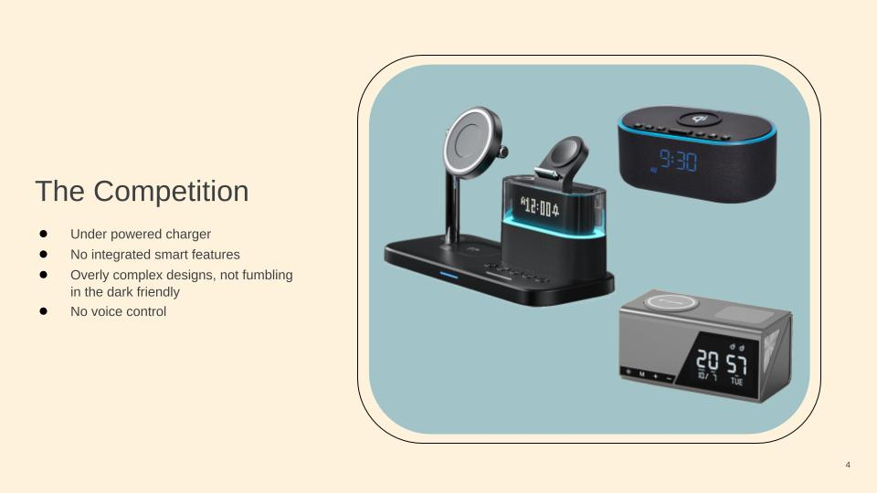
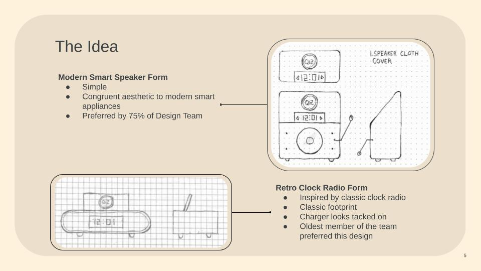
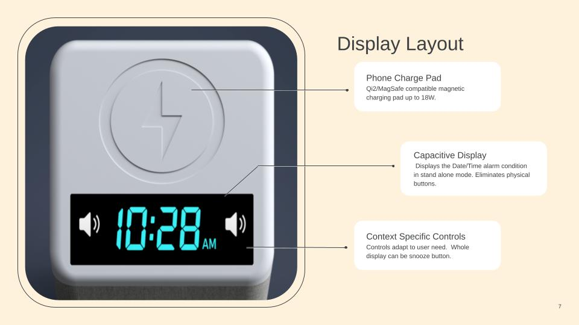
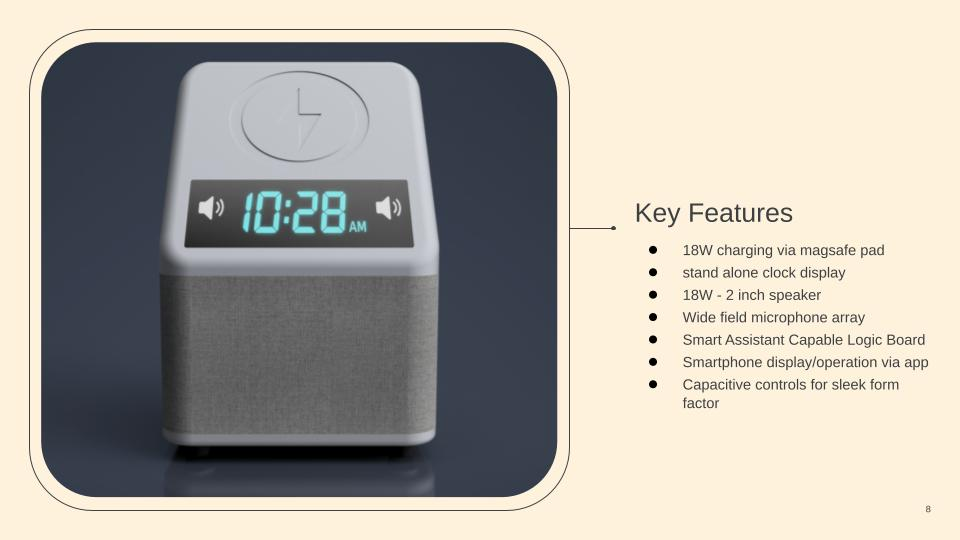
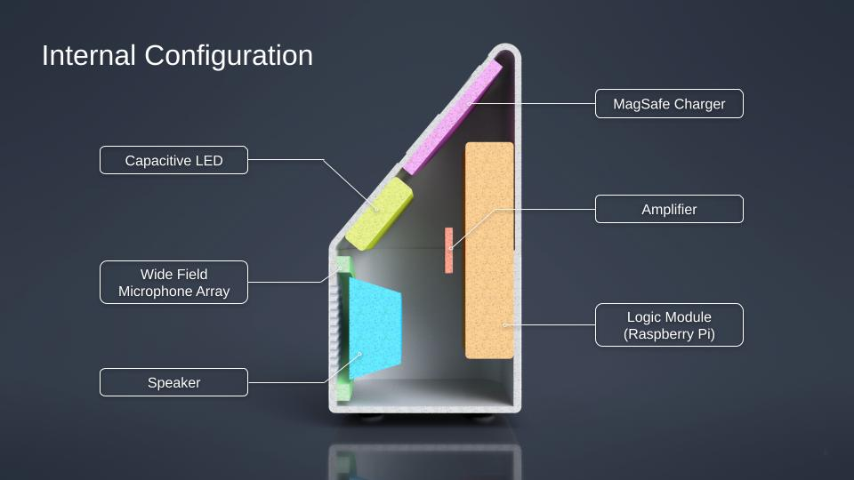

# 02. Product Development Presentation
A product proposal showcase outlining market research, concept design, and proprosed product requirements.

## Slide Previews & Key Insights

Key slides detailing the design's evolution are previewed below.

  
  

  
  

  
  

---
📂 **Full Document:** [View the Complete Presentation (PDF)](images/KIELER-DE10.pdf)
---

