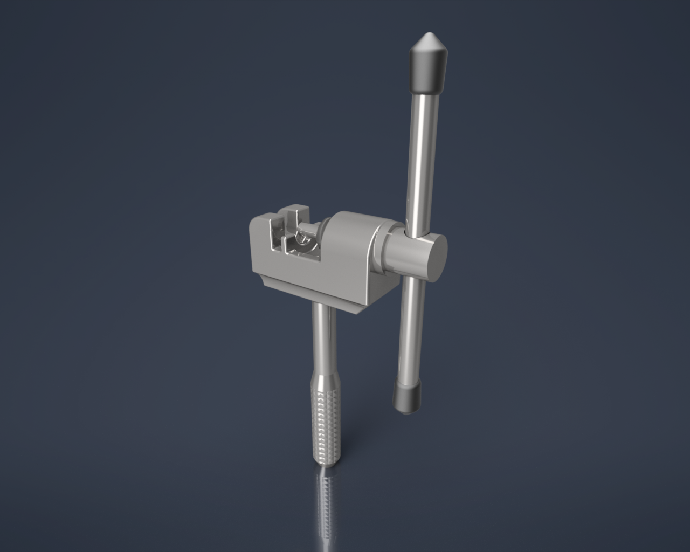
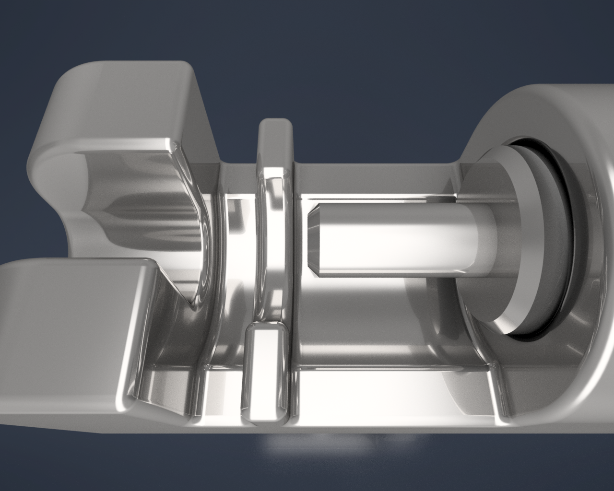
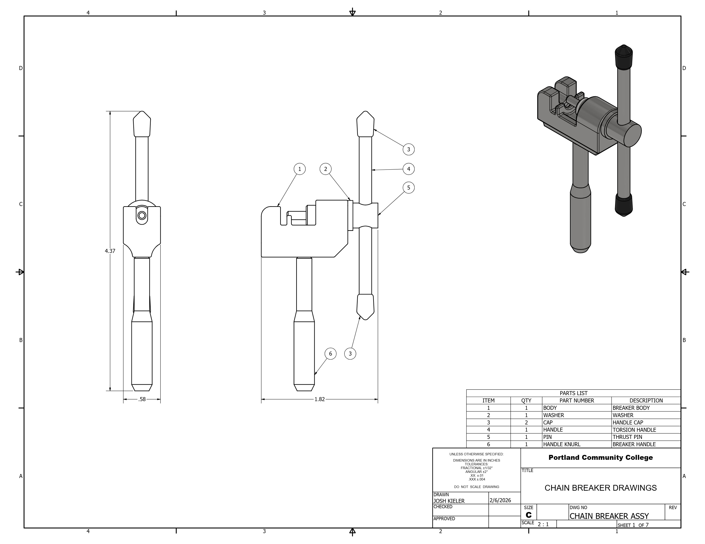
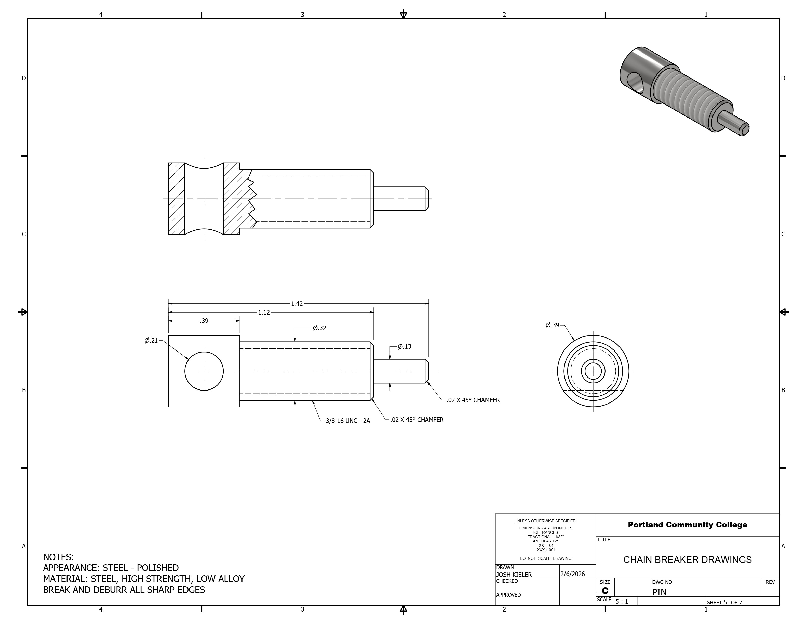
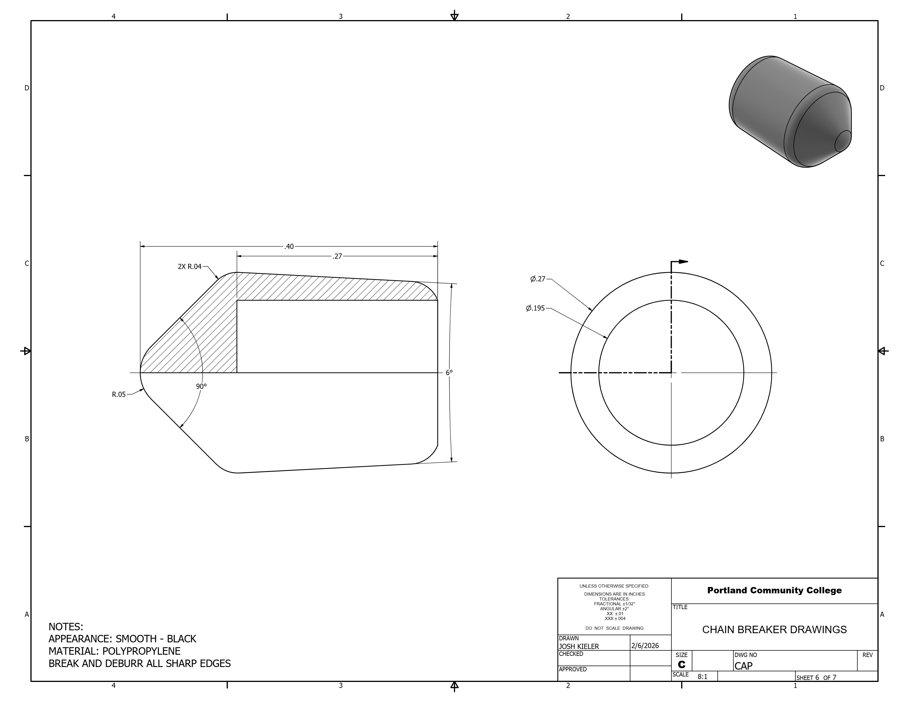
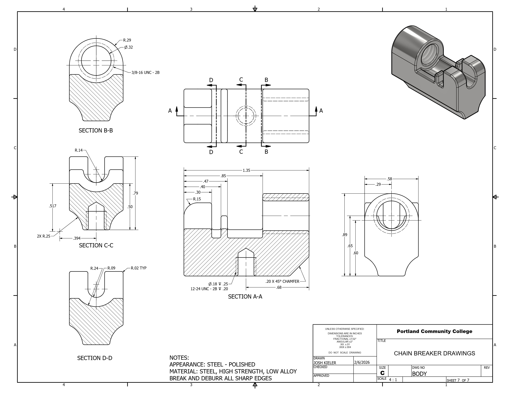

# 03. Inventor Mechanical Drawing Package (Chain Breaker)
A production-ready technical drawing package for a mechanical chain breaker assembly, detailing manufacturing specifications, tolerances, and multi-part bill of materials.

## Assembly Concepts & Mechanisms
High-fidelity Autodesk Inventor renders.

  
  

  <em>Figure 1: (Left) Full tool assembly. (Right) Detail view.</em>

## Production Drawing Previews

Selected sheets showcasing standard drafting practices and clear drawing hierarchy.

  
  

  
  

  <em>Figure 2: Component detail and assembly sheets formatted to ANSI drafting standards.</em>

---
📂 **Full Document:** [View Complete Drawing Package (PDF)](ChainBreakerDrawings.pdf)
---

